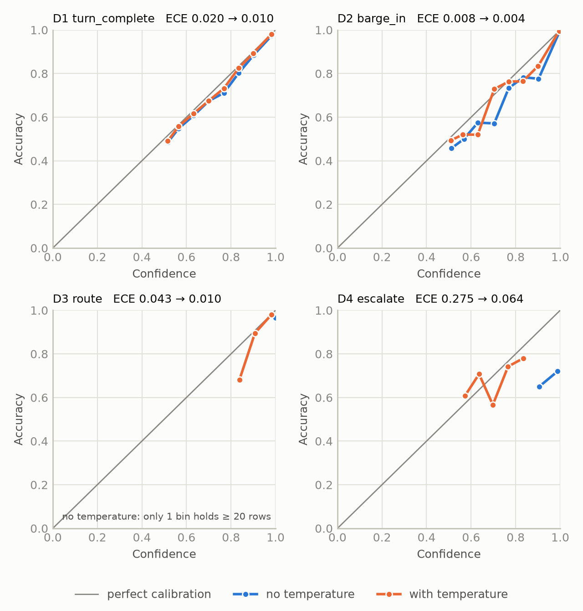

# floorcall

**A millisecond decision layer for voice agents.** Inside a real-time voice pipeline, floorcall
answers the typed questions an agent must settle before it acts, in one batched forward call of a
small encoder model:

- Is the user done talking, or just pausing?
- The user spoke while the agent was talking. Was that "uh-huh", a real interruption, or noise?
- What does the user want, and does this agent handle it at all?
- Should this conversation go to a human?

It runs [Laya](https://github.com/NandhaKishorM/laya), an open-weight (Apache-2.0),
non-autoregressive decision model, fine-tuned and recalibrated on real conversational data. The
decision processor depends on no framework. Wrapping it for a
[Pipecat](https://github.com/pipecat-ai/pipecat) voice pipeline, with live mode, is planned for v2
(docs/DECISIONS.md D-044, D-045).

> **Status, 2026-10-01.** Milestones 0 to 2 are done: the spike
> ([docs/spike-m0.md](docs/spike-m0.md)), the data ([docs/data.md](docs/data.md)), and Tables A to
> C with the curves. Milestone 3 is done too: the decision processor, the naive baseline agent and
> replay mode. Table D's ablation arms are training on Kaggle. Every other cell says TODO until a
> committed command measures it, and nothing in this README is an estimate.

## Why a decision model and not an LLM

A voice agent has well under a second to hear the user, decide, think and speak before the
conversation feels broken. Speech recognition, the response LLM and speech synthesis already use
most of that budget. The inline decisions (stop talking? respond yet?) have to fit in the tens of
milliseconds that are left, and a generative LLM call cannot.

## Results

### Table A: quality per decision

Frozen test sets (`data/test_frozen/`). Rendered from `results/table_a/` by `uv run floorcall eval
readme`; a row without a results file says TODO.

<!-- table-a:start -->
| Decision | Model | Accuracy [95% CI] | Macro-F1 | ECE | Brier | Hard-subset acc. (n) |
|---|---|---|---|---|---|---|
| D1 turn_complete | majority class (train prior) | 0.590 [0.582, 0.597] | 0.371 | 0.000 | 0.484 | 1.000 (775) |
| D1 turn_complete | TF-IDF + logistic regression | 0.624 [0.616, 0.632] | 0.544 [0.536, 0.553] | 0.008 [0.006, 0.018] | 0.456 [0.452, 0.460] | 0.843 [0.817, 0.868] (775) |
| D1 turn_complete | stock Laya, zero-shot | 0.488 [0.480, 0.496] | 0.485 | 0.028 | 0.510 | 0.505 (775) |
| D1 turn_complete | fine-tuned | 0.820 [0.813, 0.826] | 0.813 [0.807, 0.820] | 0.020 [0.015, 0.026] | 0.243 [0.237, 0.250] | 0.725 [0.693, 0.755] (775) |
| D1 turn_complete | fine-tuned + temperature | 0.820 [0.813, 0.826] | 0.813 [0.807, 0.820] | 0.010 [0.007, 0.016] | 0.243 [0.236, 0.249] | 0.725 [0.693, 0.755] (775) |
| D1 turn_complete | prompted LLM, stated probabilities | 0.721 [0.714, 0.728] | 0.721 | 0.138 | 0.435 | 0.412 (775) |
| D2 barge_in | majority class (train prior) | 0.501 [0.493, 0.510] | 0.223 | 0.010 | 0.564 | 0.453 (5012) |
| D2 barge_in | lexical rule: backchannel words + length | 0.951 [0.948, 0.955] | 0.908 [0.901, 0.916] | 0.001 [0.000, 0.005] | 0.092 [0.085, 0.098] | 0.985 [0.981, 0.988] (5012) |
| D2 barge_in | TF-IDF + logistic regression | 0.931 [0.926, 0.935] | 0.850 [0.840, 0.859] | 0.015 [0.012, 0.019] | 0.102 [0.097, 0.107] | 0.963 [0.958, 0.968] (5012) |
| D2 barge_in | stock Laya, zero-shot | 0.368 [0.360, 0.376] | 0.238 | 0.005 | 0.661 | 0.439 (5012) |
| D2 barge_in | fine-tuned | 0.969 [0.966, 0.972] | 0.937 [0.931, 0.943] | 0.008 [0.006, 0.010] | 0.042 [0.039, 0.046] | 0.977 [0.972, 0.981] (5012) |
| D2 barge_in | fine-tuned + temperature | 0.969 [0.966, 0.972] | 0.937 [0.931, 0.943] | 0.003 [0.003, 0.006] | 0.042 [0.038, 0.045] | 0.977 [0.972, 0.981] (5012) |
| D2 barge_in | prompted LLM, stated probabilities | 0.708 [0.700, 0.716] | 0.574 | 0.196 | 0.493 | 0.711 (5012) |
| D3 route | majority class (train prior) | 0.690 [0.666, 0.713] | 0.051 | 0.547 | 0.837 | n/a |
| D3 route | TF-IDF + logistic regression | 0.908 [0.893, 0.923] | 0.848 [0.820, 0.872] | 0.057 [0.046, 0.071] | 0.147 [0.130, 0.165] | n/a |
| D3 route | stock Laya, zero-shot | 0.934 [0.921, 0.946] | 0.866 | 0.030 | 0.115 | n/a |
| D3 route | fine-tuned | 0.948 [0.937, 0.959] | 0.906 [0.881, 0.926] | 0.043 [0.033, 0.054] | 0.090 [0.071, 0.111] | n/a |
| D3 route | fine-tuned + temperature | 0.948 [0.937, 0.959] | 0.906 [0.881, 0.926] | 0.011 [0.008, 0.023] | 0.082 [0.065, 0.100] | n/a |
| D3 route | prompted LLM, stated probabilities | 0.970 [0.961, 0.979] | 0.939 [0.918, 0.956] | 0.028 [0.021, 0.037] | 0.058 [0.044, 0.074] | n/a |
| D4 escalate | majority class (calib prior) | 0.555 [0.485, 0.625] | 0.357 [0.327, 0.385] | 0.025 [0.000, 0.095] | 0.495 [0.487, 0.504] | 0.710 [0.620, 0.800] (100) |
| D4 escalate | TF-IDF + logistic regression (θ = 0.240) | 0.685 [0.620, 0.750] | 0.681 [0.613, 0.743] | 0.167 [0.125, 0.239] | 0.473 [0.386, 0.561] | 0.740 [0.650, 0.820] (100) |
| D4 escalate | stock Laya, zero-shot | 0.665 [0.600, 0.730] | 0.625 [0.554, 0.693] | 0.092 [0.057, 0.159] | 0.422 [0.396, 0.447] | 0.730 [0.640, 0.810] (100) |
| D4 escalate | stock Laya, calib threshold (θ = 0.505) | 0.645 [0.580, 0.710] | 0.579 [0.506, 0.649] | 0.092 [0.057, 0.159] | 0.422 [0.396, 0.447] | 0.700 [0.610, 0.790] (100) |
| D4 escalate | fine-tuned | 0.695 [0.630, 0.755] | 0.672 [0.602, 0.737] | 0.277 [0.220, 0.340] | 0.544 [0.434, 0.658] | 0.740 [0.650, 0.820] (100) |
| D4 escalate | fine-tuned + temperature | 0.695 [0.630, 0.755] | 0.672 [0.602, 0.737] | 0.064 [0.040, 0.135] | 0.418 [0.363, 0.475] | 0.740 [0.650, 0.820] (100) |
| D4 escalate | fine-tuned + temperature, calib threshold (θ = 0.505) | 0.705 [0.640, 0.765] | 0.681 [0.612, 0.747] | 0.064 [0.040, 0.135] | 0.418 [0.363, 0.475] | 0.750 [0.660, 0.830] (100) |
| D4 escalate | prompted LLM, stated probabilities | 0.635 [0.570, 0.700] | 0.610 [0.538, 0.677] | 0.248 [0.186, 0.312] | 0.539 [0.445, 0.635] | 0.570 [0.470, 0.660] (100) |
<!-- table-a:end -->

Brier is the multi-class form Σₖ(pₖ − yₖ)², range [0, 2]; for a binary decision it is twice the
familiar (p − y)². ECE uses 15 equal-width bins over the probability of the reported answer. The
95% interval on accuracy is Wilson's, except in rows scored with a percentile bootstrap (10,000
resamples of the rows): there every metric has its 95% interval in brackets. All fine-tuned rows
and all D4 rows are bootstrapped; the earlier stock-Laya and majority rows of D1–D3 are not. D4's
test set is small: 200 hand-labelled messages, drawn in four equal strata, so its escalation rate
(89 of 200) is not the natural one. D4's majority prior comes from calib, which is drawn the same
way. θ is p(escalate) at or above which a row counts as escalate, chosen on calib by macro-F1
(docs/DECISIONS.md D-035); ECE and Brier describe the probabilities, which θ does not change.

The fine-tuned rows are one multi-task checkpoint (`checkpoints/main-r2`): epoch 2 of 4, chosen by
cross-entropy on a dev split carved from train, trained with soft cross-entropy only (D-035
amendment 1), temperatures fitted on calib. D4 trained on LLM labels (prompt v3, 6,000 train-pool
messages) that the gate did not accept: against Yash's calib labels they under-escalate (recall
0.426). Its test labels are Yash's. D1's hard subset is truncations only, all labelled
incomplete, so a constant "incomplete" predictor such as the majority baseline scores 1.000 on it;
the column is only informative for models that are not constant. D3's test set is 69%
out_of_scope, so macro-F1 is its headline number.

**Not compared: LiveKit's text turn detector.** The spec planned it as a D1 baseline, and the
model (`livekit/turn-detector`) is still published. Its licence, the LiveKit Model License, allows
use only "with LiveKit Agents", not "on a standalone basis", and forbids using its outputs "to
improve or otherwise develop any other models". A comparison run in this repository's harness would
be standalone use, so it is not run here (docs/DECISIONS.md D-029).

### Table B: latency (batch 1)

Rendered from `results/table_b/` (`uv run floorcall eval latency`, then `uv run floorcall eval
readme`). Budgets: p99 ≤ 50 ms on GPU, ≤ 100 ms on CPU.

<!-- table-b:start -->
| Path | p50 ms | p95 ms | p99 ms | of which forward, p50 | of which packing, p50 | Fits budget (p99) |
|---|---|---|---|---|---|---|
| GPU, CUDA graphs: user_pause, 3 questions in 1 call | 29.1 | 55.6 | 59.0 | 24.6 | 0.8 | no (≤ 50 ms) |
| GPU, CUDA graphs: user_pause, 3 questions in 3 calls | 52.4 | 79.2 | 85.2 | 43.1 | 0.8 | no (≤ 50 ms) |
| GPU, CUDA graphs: user_speech_during_agent, 2 questions in 1 call | 44.3 | 54.9 | 57.4 | 38.3 | 1.9 | no (≤ 50 ms) |
| GPU, eager: user_pause, 3 questions in 1 call | 56.4 | 82.3 | 88.5 | 50.3 | 1.1 | no (≤ 50 ms) |
| GPU, eager: user_pause, 3 questions in 3 calls | 120.4 | 158.6 | 179.3 | 110.0 | 0.9 | no (≤ 50 ms) |
| GPU, eager: user_speech_during_agent, 2 questions in 1 call | 55.4 | 66.4 | 73.7 | 49.1 | 2.5 | no (≤ 50 ms) |
| CPU: user_pause, 3 questions in 1 call | 976.9 | 2162.4 | 2219.8 | 973.1 | 0.7 | no (≤ 100 ms) |
| CPU: user_pause, 3 questions in 3 calls | 680.9 | 1899.1 | 1953.6 | 674.0 | 0.6 | no (≤ 100 ms) |
| CPU: user_speech_during_agent, 2 questions in 1 call | 1153.6 | 1426.7 | 1464.5 | 1149.7 | 1.4 | no (≤ 100 ms) |
| prompted LLM (gpt-oss-20b via OpenRouter, pinned DeepInfra bf16), user_pause, 3 questions in 1 call: network latency, request to parsed answer | 2565.1 | 4270.7 | 6072.2 | n/a | n/a | no (≤ 50 ms) |
<!-- table-b:end -->

<!-- table-b-env:start -->
Measured on NVIDIA GeForce RTX 5070 Ti Laptop GPU (driver 591.86) and Intel64 Family 6 Model 197 Stepping 2, GenuineIntel with 16 torch threads; on AC power: True; torch 2.14.0+cu130, laya 0.3.21. GPU rows measured 2026-09-30 (UTC). Windows power mode: Best performance. GPU power limit: vendor default, 80 W base plus Dynamic Boost (115 W enforced at the start). Batch 1, 50 warmup and 1000 timed iterations over 50 fixed inputs per event; every timed call is a full `Decider.decide` (packing, tokenizing, forward, temperatures).
<!-- table-b-env:end -->

"3 questions in 1 call" is one batched forward pass with one row per question; each row re-reads
the state (docs/DECISIONS.md D-003). The GPU rows above are the final latency session
(docs/DECISIONS.md D-040). They are the fine-tuned checkpoint at the fp16 default, with the stock
checkpoint back to back, alternating which went first. The laptop was on factory settings: G-Helper
defaults (no clock offsets), Windows' Best performance mode, and the vendor's power limit of 80 W
base plus Dynamic Boost. Every row waited for the GPU to cool to 55 °C, was sampled by nvidia-smi
throughout, and would have been discarded and retried had the GPU throttled while it was timed
(docs/DECISIONS.md D-037). None did; the table below shows each row's conditions. **No GPU path
meets p99 ≤ 50 ms**, and the p99 is reported as measured. Earlier GPU numbers were taken overclocked
and are discarded. The CPU rows are the fine-tuned checkpoint at fp32 (the CPU forward), measured
2026-09-30 in chunks of at most 20 minutes, with a 10-minute cooldown and the temperature gate
between chunks (docs/DECISIONS.md D-037). **Every CPU path misses p99 ≤ 100 ms by 15–22×.**

<!-- table-b-gpu:start -->
| Path | Stock p50 / p99 ms | Fine-tuned p50 / p99 ms | Fine-tuned vs stock, p50 | GPU max °C (stock / fine-tuned) | SM clock median, MHz | Power median / limit, W | Throttled while timed |
|---|---|---|---|---|---|---|---|
| GPU, CUDA graphs: user_pause, 3 questions in 1 call | 37.3 / 74.7 | 29.1 / 59.0 | -22.0% | 74 / 69 | 2257 / 2010 | 111 / 109 of 115 | no |
| GPU, CUDA graphs: user_pause, 3 questions in 3 calls | 51.5 / 83.9 | 52.4 / 85.2 | +1.6% | 74 / 74 | 2332 / 2306 | 102 / 102 of 115 | no |
| GPU, CUDA graphs: user_speech_during_agent, 2 questions in 1 call | 44.3 / 56.4 | 44.3 / 57.4 | +0.2% | 75 / 75 | 2242 / 2220 | 110 / 110 of 115 | no |
| GPU, eager: user_pause, 3 questions in 1 call | 54.4 / 84.9 | 56.4 / 88.5 | +3.7% | 75 / 76 | 2332 / 2257 | 103 / 100 of 115 | no |
| GPU, eager: user_pause, 3 questions in 3 calls | 123.1 / 160.8 | 120.4 / 179.3 | -2.2% | 71 / 71 | 2505 / 2512 | 76 / 77 of 115 | no |
| GPU, eager: user_speech_during_agent, 2 questions in 1 call | 55.0 / 71.5 | 55.4 / 73.7 | +0.8% | 74 / 74 | 2265 / 2280 | 98 / 99 of 115 | no |
<!-- table-b-gpu:end -->

<!-- table-b-power:start -->
GPU power while timed, from nvidia-smi every 500 ms. Every GPU row ran power-limited:

- Session `00edac0` (18 rows, from 2026-09-30 UTC): enforced power limit 85 to 95 W; each row's median draw while timed 76 to 94 W; the driver's power cap active in 85% of 2740 timed samples; Windows power mode: not recorded.
- Session `ab4c45c` (12 rows, from 2026-09-30 UTC): enforced power limit 90 to 115 W; each row's median draw while timed 76 to 111 W; the driver's power cap active in 55% of 1503 timed samples; Windows power mode: Best performance.
<!-- table-b-power:end -->

**Inference precision.** fp16 autocast is the default since docs/DECISIONS.md D-040. It was
chosen from the table below, an earlier session (D-039) that timed the fine-tuned checkpoint back to
back at fp32 (no autocast), bf16 autocast (Laya's own default on this GPU) and fp16 autocast, under
the same thermal rules. A precision was timed only if its answers agreed with fp32's on at least
99.5% of every calib and dev set.

<!-- table-b-precision:start -->
| Path | fp32 p50 / p99 ms | bf16 p50 / p99 ms | fp16 p50 / p99 ms | GPU max °C (fp32 / bf16 / fp16) | Throttled while timed |
|---|---|---|---|---|---|
| GPU, CUDA graphs: user_pause, 3 questions in 1 call | 72.8 / 160.8 | 40.2 / 80.7 | 38.9 / 77.6 | 70 / 69 / 69 | no |
| GPU, CUDA graphs: user_pause, 3 questions in 3 calls | 69.7 / 155.8 | 50.3 / 81.1 | 55.4 / 89.7 | 69 / 68 / 69 | no |
| GPU, CUDA graphs: user_speech_during_agent, 2 questions in 1 call | 94.5 / 116.3 | 50.7 / 65.9 | 45.6 / 57.9 | 69 / 70 / 69 | no |
| GPU, eager: user_pause, 3 questions in 1 call | 79.8 / 175.4 | 54.4 / 88.3 | 54.6 / 88.8 | 69 / 69 / 69 | no |
| GPU, eager: user_pause, 3 questions in 3 calls | 112.1 / 176.5 | 115.3 / 158.7 | 112.5 / 167.2 | 70 / 66 / 67 | no |
| GPU, eager: user_speech_during_agent, 2 questions in 1 call | 96.7 / 119.4 | 59.0 / 79.1 | 57.6 / 76.8 | 70 / 69 / 69 | no |

Parity against fp32 on calib and dev (21906 rows, never test; bar 99.5%): bf16: worst argmax agreement 99.85% (turn_complete/dev), largest probability difference 0.068, passed; fp16: worst argmax agreement 100.00% (turn_complete/calib), largest probability difference 0.021, passed.
<!-- table-b-precision:end -->

The precision table is its own session, at that time's power settings (the power note above), and
this laptop's timings move between sessions: compare its fp16 column with Table B's rows. Compare
precisions within the table, not across tables.

Both checkpoints have the same weights in size and precision. They time within 4% of each other on
five of the six GPU paths. The exception is the session's first row (CUDA graphs, user_pause), where
the fine-tuned checkpoint ran first and came in faster; it did in the previous session too. That
points to the first row of a session, not to the fine-tuning. The laptop GPU ran
against its power limit for much of every row; that is its normal state under load, and it is
recorded, not a reason to discard. Each row is still one run, and on this laptop the tail moves
between runs (docs/DECISIONS.md D-028). Read a p99 here as one measurement on a power-limited
laptop GPU, not a guarantee.

### Table C: robustness to ASR noise

The fine-tuned, calibrated model on the same test sets, with the user's words degraded as a
recogniser might: each word deleted with probability level/2 or replaced by a common word with
probability level/2, and the last one or two words missing with probability level
(`floorcall.evaluate.robustness`). Cells are macro-F1 (accuracy).

<!-- table-c:start -->
| Decision | noise 0.00 | noise 0.05 | noise 0.10 | noise 0.20 |
|---|---|---|---|---|
| D1 turn_complete | 0.814 (0.820) | 0.775 (0.786) | 0.743 (0.760) | 0.679 (0.713) |
| D2 barge_in | 0.937 (0.969) | 0.865 (0.927) | 0.810 (0.887) | 0.728 (0.814) |
| D3 route | 0.906 (0.948) | 0.882 (0.937) | 0.845 (0.919) | 0.759 (0.878) |
| D4 escalate | 0.672 (0.695) | 0.650 (0.675) | 0.643 (0.680) | 0.631 (0.665) |
<!-- table-c:end -->

Table C is scored at the fp16 default (docs/DECISIONS.md D-040), and Table A's fine-tuned rows at
bf16, the default then. So the noise 0.00 column is Table A's "fine-tuned + temperature" computation
at a different precision. It differs on 37 of 14,998 D1 predictions and 5 of 13,360 D2 predictions,
and on none for D3 or D4, which moves accuracy and macro-F1 by at most 0.0003.

### Table D: ablations

Table D is trained on Kaggle: four arms (the full model and the three ablations), 2 epochs each,
with the Kaggle full arm as the reference its ablations are read against, not r2 (docs/DECISIONS.md
D-038). Each variant is a separately trained, calibrated checkpoint, scored under the same state
settings it trained with. The normalization ablation is scored twice: on written text, where punctuation leaks
the answer, and on ASR-style text, which is what a live pipeline delivers. The arms train in fp16
on a Tesla T4. The full arm's macro-F1 lands within 0.011 of Table A's fine-tuned + temperature row
on D1–D3 and within 0.023 on D4 (n = 200). Its D1 hard-subset accuracy is 0.050 lower
(docs/DECISIONS.md D-038 outcome).

<!-- table-d:start -->
| Variant | D1 macro-F1 (acc) | D1 hard acc. | D2 macro-F1 (acc) | D2 hard acc. | D3 macro-F1 (acc) | D4 macro-F1 (acc) |
|---|---|---|---|---|---|---|
| full model | 0.824 (0.827) | 0.675 | 0.941 (0.973) | 0.994 | 0.911 (0.955) | 0.695 (0.715) |
| without recent_turns | TODO | TODO | TODO | TODO | TODO | TODO |
| without agent_last_utterance | TODO | TODO | TODO | TODO | TODO | TODO |
| without normalization, scored on written text | TODO | TODO | TODO | TODO | TODO | TODO |
| without normalization, scored on ASR-style text | TODO | TODO | TODO | TODO | TODO | TODO |
<!-- table-d:end -->

### Operating points and curves

Each threshold is a point on a tradeoff curve, chosen on the **calib** split: the smallest θ whose
calib rate of the costly error stays at or under 5% (false stops for θ_interrupt, premature
responses for θ_yield). The test columns then show what that θ does. Added delay assumes the pause
event fires after 300 ms of silence and the safety net answers at 2,000 ms
(`floorcall.evaluate.curves`). Rendered from `results/curves/` by `uv run floorcall eval curves`,
then `eval figures` and `eval readme`.

<!-- operating-points:start -->
| Model | θ_interrupt | false stops (test) | missed interruptions (test) | θ_yield | premature responses (test) | added delay, ms (test) |
|---|---|---|---|---|---|---|
| stock Laya | 0.340 | 0.040 | 0.931 | 0.630 | 0.055 | 1599 |
| fine-tuned + temperature | 0.090 | 0.050 | 0.003 | 0.785 | 0.043 | 903 |
<!-- operating-points:end -->

<!-- figures:start -->
<picture>
  <source media="(prefers-color-scheme: dark)" srcset="results/figures/tradeoff_interrupt.dark.png">
  
</picture>

<picture>
  <source media="(prefers-color-scheme: dark)" srcset="results/figures/tradeoff_yield.dark.png">
  
</picture>

<picture>
  <source media="(prefers-color-scheme: dark)" srcset="results/figures/reliability_finetuned_temp.dark.png">
  
</picture>

<picture>
  <source media="(prefers-color-scheme: dark)" srcset="results/figures/reliability_stock_laya.dark.png">
  
</picture>
<!-- figures:end -->

## Replay: the same call through a naive agent and through floorcall

```bash
uv run floorcall replay demo/scripts/*.json --compare naive    # no API key, no GPU
```

Eight scripted banking calls go through both agents:
- backchannels against a real interruption;
- "yeah" against "yeah but";
- talk to someone else in the room;
- a mid-request pause against a finished question;
- an out-of-scope request;
- a frustrated user asking for a person.

The naive agent answers after 800 ms of silence and stops whenever the user speaks. The report
shows every decision point, what each agent did, the consequence, and where the two diverge. The
full output is in [results/replay/replay.txt](results/replay/replay.txt), and floorcall gets some
points wrong.

**These scripts are illustrative demos, not an evaluation set.** The evaluation is Tables A to D.
The scripts were written and frozen by hash before floorcall first ran on them, and they have not
been changed since. On replay's clock, each floorcall decision costs its event's GPU p50 from
Table B. The CPU compute time is reported separately, labelled as CPU, and it does not move the
timeline (docs/DECISIONS.md D-046).

## Design notes

Every divergence from the original spec, and why, is in [docs/DECISIONS.md](docs/DECISIONS.md).

## Setup

```bash
uv sync                                              # NVIDIA GPU (CUDA 13 driver), the default
uv sync --no-default-groups --group dev --group cpu  # no NVIDIA GPU
uv run pytest
```

## Licence

Code: Apache-2.0. Derived datasets inherit their sources' licences, including SwDA's
CC BY-NC-SA 3.0 (non-commercial), and each dataset card says which.
