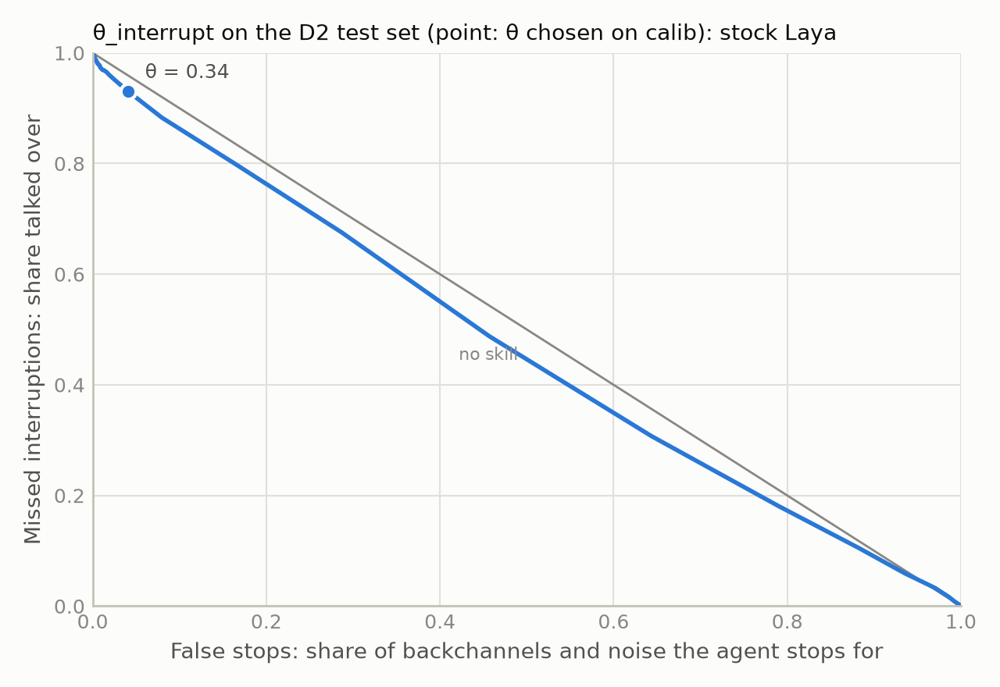
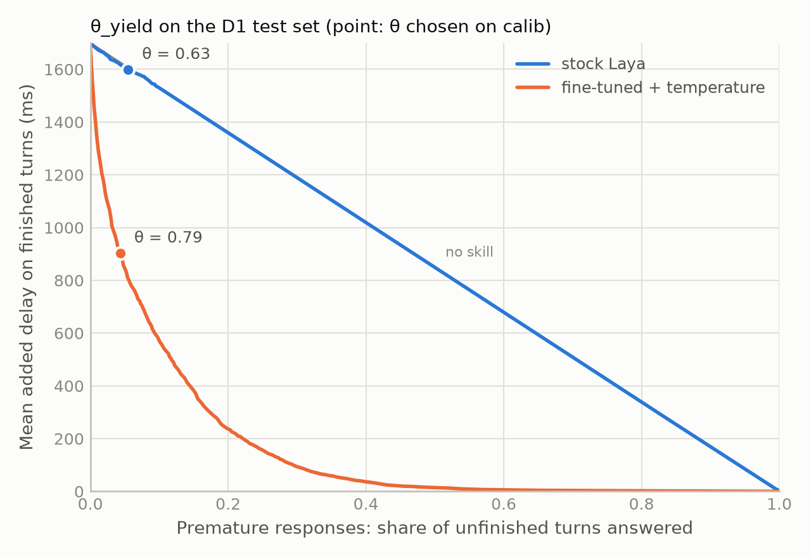
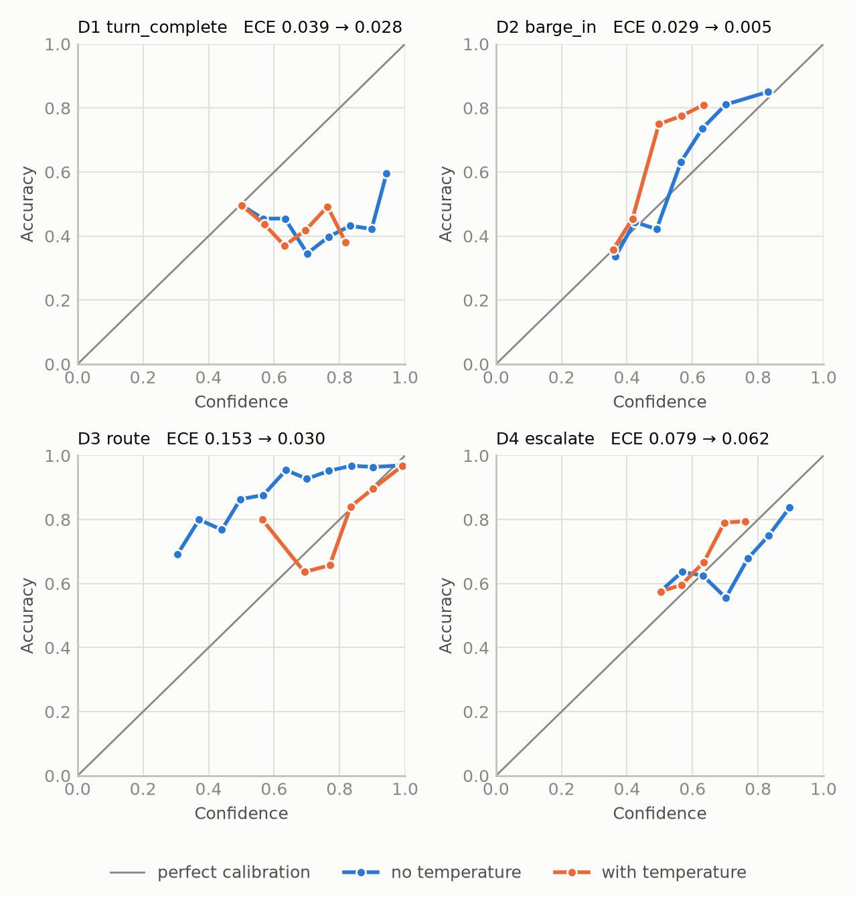

# floorcall

**A millisecond decision layer for voice agents.** Inside a real-time voice pipeline, floorcall
answers the typed questions an agent must settle before it acts, in one batched forward call of a
small encoder model:

- Is the user done talking, or just pausing?
- The user spoke while the agent was talking. Was that "uh-huh", a real interruption, or noise?
- What does the user want, and does this agent handle it at all?
- Should this conversation go to a human?

It runs [Laya](https://github.com/NandhaKishorM/laya), an open-weight (Apache-2.0),
non-autoregressive decision model, fine-tuned and recalibrated on real conversational data. It is
plugged into a [Pipecat](https://github.com/pipecat-ai/pipecat) voice pipeline.

> **Status, 2026-09-29.** Milestone 0 (the feasibility spike, [docs/spike-m0.md](docs/spike-m0.md))
> is done. So is milestone 1 (data, [docs/data.md](docs/data.md)), including D4's hand-labelled
> test set: v2, 200 messages relabelled blind under guideline v2 (docs/DECISIONS.md D-033). Table
> A's baseline and fine-tuned rows are measured for all four decisions. Every other cell says TODO
> until a committed command measures it, and nothing in this README is an estimate.

## Why a decision model and not an LLM

A voice agent has well under a second to hear the user, decide, think and speak before the
conversation feels broken. Speech recognition, the response LLM and speech synthesis already use
most of that budget. The inline decisions (stop talking? respond yet?) have to fit in the tens of
milliseconds that are left, and a generative LLM call cannot.

## Results

### Table A: quality per decision

Frozen test sets (`data/test_frozen/`). Rendered from `results/table_a/` by `uv run floorcall eval
readme`; a row without a results file says TODO.

<!-- table-a:start -->
| Decision | Model | Accuracy [95% CI] | Macro-F1 | ECE | Brier | Hard-subset acc. (n) |
|---|---|---|---|---|---|---|
| D1 turn_complete | majority class (train prior) | 0.590 [0.582, 0.597] | 0.371 | 0.000 | 0.484 | 1.000 (775) |
| D1 turn_complete | TF-IDF + logistic regression | 0.624 [0.616, 0.632] | 0.544 [0.536, 0.553] | 0.008 [0.006, 0.018] | 0.456 [0.452, 0.460] | 0.843 [0.817, 0.868] (775) |
| D1 turn_complete | stock Laya, zero-shot | 0.488 [0.480, 0.496] | 0.485 | 0.028 | 0.510 | 0.505 (775) |
| D1 turn_complete | fine-tuned | 0.820 [0.813, 0.826] | 0.813 [0.807, 0.820] | 0.020 [0.015, 0.026] | 0.243 [0.237, 0.250] | 0.725 [0.693, 0.755] (775) |
| D1 turn_complete | fine-tuned + temperature | 0.820 [0.813, 0.826] | 0.813 [0.807, 0.820] | 0.010 [0.007, 0.016] | 0.243 [0.236, 0.249] | 0.725 [0.693, 0.755] (775) |
| D1 turn_complete | prompted LLM, stated probabilities | TODO | TODO | TODO | TODO | TODO |
| D2 barge_in | majority class (train prior) | 0.501 [0.493, 0.510] | 0.223 | 0.010 | 0.564 | 0.453 (5012) |
| D2 barge_in | lexical rule: backchannel words + length | 0.951 [0.948, 0.955] | 0.908 [0.901, 0.916] | 0.001 [0.000, 0.005] | 0.092 [0.085, 0.098] | 0.985 [0.981, 0.988] (5012) |
| D2 barge_in | TF-IDF + logistic regression | 0.931 [0.926, 0.935] | 0.850 [0.840, 0.859] | 0.015 [0.012, 0.019] | 0.102 [0.097, 0.107] | 0.963 [0.958, 0.968] (5012) |
| D2 barge_in | stock Laya, zero-shot | 0.368 [0.360, 0.376] | 0.238 | 0.005 | 0.661 | 0.439 (5012) |
| D2 barge_in | fine-tuned | 0.969 [0.966, 0.972] | 0.937 [0.931, 0.943] | 0.008 [0.006, 0.010] | 0.042 [0.039, 0.046] | 0.977 [0.972, 0.981] (5012) |
| D2 barge_in | fine-tuned + temperature | 0.969 [0.966, 0.972] | 0.937 [0.931, 0.943] | 0.003 [0.003, 0.006] | 0.042 [0.038, 0.045] | 0.977 [0.972, 0.981] (5012) |
| D2 barge_in | prompted LLM, stated probabilities | TODO | TODO | TODO | TODO | TODO |
| D3 route | majority class (train prior) | 0.690 [0.666, 0.713] | 0.051 | 0.547 | 0.837 | n/a |
| D3 route | TF-IDF + logistic regression | 0.908 [0.893, 0.923] | 0.848 [0.820, 0.872] | 0.057 [0.046, 0.071] | 0.147 [0.130, 0.165] | n/a |
| D3 route | stock Laya, zero-shot | 0.934 [0.921, 0.946] | 0.866 | 0.030 | 0.115 | n/a |
| D3 route | fine-tuned | 0.948 [0.937, 0.959] | 0.906 [0.881, 0.926] | 0.043 [0.033, 0.054] | 0.090 [0.071, 0.111] | n/a |
| D3 route | fine-tuned + temperature | 0.948 [0.937, 0.959] | 0.906 [0.881, 0.926] | 0.011 [0.008, 0.023] | 0.082 [0.065, 0.100] | n/a |
| D3 route | prompted LLM, stated probabilities | TODO | TODO | TODO | TODO | TODO |
| D4 escalate | majority class (calib prior) | 0.555 [0.485, 0.625] | 0.357 [0.327, 0.385] | 0.025 [0.000, 0.095] | 0.495 [0.487, 0.504] | 0.710 [0.620, 0.800] (100) |
| D4 escalate | TF-IDF + logistic regression (θ = 0.240) | 0.685 [0.620, 0.750] | 0.681 [0.613, 0.743] | 0.167 [0.125, 0.239] | 0.473 [0.386, 0.561] | 0.740 [0.650, 0.820] (100) |
| D4 escalate | stock Laya, zero-shot | 0.665 [0.600, 0.730] | 0.625 [0.554, 0.693] | 0.092 [0.057, 0.159] | 0.422 [0.396, 0.447] | 0.730 [0.640, 0.810] (100) |
| D4 escalate | stock Laya, calib threshold (θ = 0.505) | 0.645 [0.580, 0.710] | 0.579 [0.506, 0.649] | 0.092 [0.057, 0.159] | 0.422 [0.396, 0.447] | 0.700 [0.610, 0.790] (100) |
| D4 escalate | fine-tuned | 0.695 [0.630, 0.755] | 0.672 [0.602, 0.737] | 0.277 [0.220, 0.340] | 0.544 [0.434, 0.658] | 0.740 [0.650, 0.820] (100) |
| D4 escalate | fine-tuned + temperature | 0.695 [0.630, 0.755] | 0.672 [0.602, 0.737] | 0.064 [0.040, 0.135] | 0.418 [0.363, 0.475] | 0.740 [0.650, 0.820] (100) |
| D4 escalate | fine-tuned + temperature, calib threshold (θ = 0.505) | 0.705 [0.640, 0.765] | 0.681 [0.612, 0.747] | 0.064 [0.040, 0.135] | 0.418 [0.363, 0.475] | 0.750 [0.660, 0.830] (100) |
| D4 escalate | prompted LLM, stated probabilities | TODO | TODO | TODO | TODO | TODO |
<!-- table-a:end -->

Brier is the multi-class form Σₖ(pₖ − yₖ)², range [0, 2]; for a binary decision it is twice the
familiar (p − y)². ECE uses 15 equal-width bins over the probability of the reported answer. The
95% interval on accuracy is Wilson's, except in rows scored with a percentile bootstrap (10,000
resamples of the rows): there every metric has its 95% interval in brackets. All fine-tuned rows
and all D4 rows are bootstrapped; the earlier stock-Laya and majority rows of D1–D3 are not. D4's
test set is small: 200 hand-labelled messages, drawn in four equal strata, so its escalation rate
(89 of 200) is not the natural one. D4's majority prior comes from calib, which is drawn the same
way. θ is p(escalate) at or above which a row counts as escalate, chosen on calib by macro-F1
(docs/DECISIONS.md D-035); ECE and Brier describe the probabilities, which θ does not change.

The fine-tuned rows are one multi-task checkpoint (`checkpoints/main-r2`): epoch 2 of 4, chosen by
cross-entropy on a dev split carved from train, trained with soft cross-entropy only (D-035
amendment 1), temperatures fitted on calib. D4 trained on LLM labels (prompt v3, 6,000 train-pool
messages) that the gate did not accept: against Yash's calib labels they under-escalate (recall
0.426). Its test labels are Yash's. D1's hard subset is truncations only, all labelled
incomplete, so a constant "incomplete" predictor such as the majority baseline scores 1.000 on it;
the column is only informative for models that are not constant. D3's test set is 69%
out_of_scope, so macro-F1 is its headline number.

**Not compared: LiveKit's text turn detector.** The spec planned it as a D1 baseline, and the
model (`livekit/turn-detector`) is still published. Its licence, the LiveKit Model License, allows
use only "with LiveKit Agents", not "on a standalone basis", and forbids using its outputs "to
improve or otherwise develop any other models". A comparison run in this repository's harness would
be standalone use, so it is not run here (docs/DECISIONS.md D-029).

### Table B: latency (batch 1)

Rendered from `results/table_b/` (`uv run floorcall eval latency`, then `uv run floorcall eval
readme`). Budgets: p99 ≤ 50 ms on GPU, ≤ 100 ms on CPU.

<!-- table-b:start -->
| Path | p50 ms | p95 ms | p99 ms | of which forward, p50 | of which packing, p50 | Fits budget (p99) |
|---|---|---|---|---|---|---|
| GPU, CUDA graphs: user_pause, 3 questions in 1 call | 32.5 | 62.2 | 64.9 | 28.6 | 0.7 | no (≤ 50 ms) |
| GPU, CUDA graphs: user_pause, 3 questions in 3 calls | 43.8 | 71.5 | 75.9 | 32.2 | 0.9 | no (≤ 50 ms) |
| GPU, CUDA graphs: user_speech_during_agent, 2 questions in 1 call | 43.0 | 53.6 | 57.6 | 35.6 | 2.5 | no (≤ 50 ms) |
| GPU, eager: user_pause, 3 questions in 1 call | 56.3 | 74.1 | 78.5 | 50.1 | 1.1 | no (≤ 50 ms) |
| GPU, eager: user_pause, 3 questions in 3 calls | 128.5 | 174.7 | 186.9 | 115.7 | 1.1 | no (≤ 50 ms) |
| GPU, eager: user_speech_during_agent, 2 questions in 1 call | 57.0 | 67.9 | 72.8 | 49.3 | 2.8 | no (≤ 50 ms) |
| CPU: user_pause, 3 questions in 1 call | 1160.9 | 2577.6 | 2647.8 | 1156.7 | 0.7 | no (≤ 100 ms) |
| CPU: user_pause, 3 questions in 3 calls | 822.6 | 2299.0 | 2347.1 | 814.9 | 0.6 | no (≤ 100 ms) |
| CPU: user_speech_during_agent, 2 questions in 1 call | 1351.5 | 1716.0 | 1750.9 | 1347.1 | 1.6 | no (≤ 100 ms) |
| prompted LLM (OpenRouter), user_pause, 3 questions in 1 call, network included | TODO | TODO | TODO | TODO | TODO | TODO |
<!-- table-b:end -->

<!-- table-b-env:start -->
Measured on NVIDIA GeForce RTX 5070 Ti Laptop GPU (driver 591.86) and Intel64 Family 6 Model 197 Stepping 2, GenuineIntel with 16 torch threads; on AC power: True; torch 2.14.0+cu130, laya 0.3.21. GPU rows measured 2026-09-30 (UTC). Batch 1, 50 warmup and 1000 timed iterations over 50 fixed inputs per event; every timed call is a full `Decider.decide` (packing, tokenizing, forward, temperatures).
<!-- table-b-env:end -->

"3 questions in 1 call" is one batched forward pass with one row per question; each row re-reads
the state (docs/DECISIONS.md D-003). The GPU rows above are the fine-tuned checkpoint's, measured
at stock clocks with the stock checkpoint back to back, alternating which went first. Every row
waited for the GPU to cool to 55 °C, was sampled by nvidia-smi throughout, and would have been
discarded and retried had the GPU throttled while it was timed (docs/DECISIONS.md D-037). The
table below shows the conditions. Earlier GPU numbers were taken overclocked and are discarded. The
CPU rows are the stock checkpoint's from 28 September; they will be re-measured in chunks with
cooldowns between them.

<!-- table-b-gpu:start -->
| Path | Stock p50 / p99 ms | Fine-tuned p50 / p99 ms | Fine-tuned vs stock, p50 | GPU max °C (stock / fine-tuned) | SM clock median, MHz | Power median / limit, W | Throttled while timed |
|---|---|---|---|---|---|---|---|
| GPU, CUDA graphs: user_pause, 3 questions in 1 call | 34.8 / 69.5 | 32.5 / 64.9 | -6.7% | 67 / 65 | 1972 / 1957 | 93 / 93 of 95 | no |
| GPU, CUDA graphs: user_pause, 3 questions in 3 calls | 44.2 / 76.9 | 43.8 / 75.9 | -0.9% | 68 / 67 | 2055 / 2070 | 86 / 87 of 95 | no |
| GPU, CUDA graphs: user_speech_during_agent, 2 questions in 1 call | 42.4 / 55.2 | 43.0 / 57.6 | +1.4% | 70 / 69 | 2025 / 2002 | 92 / 91 of 95 | no |
| GPU, eager: user_pause, 3 questions in 1 call | 58.2 / 78.3 | 56.3 / 78.5 | -3.2% | 69 / 69 | 2227 / 2167 | 91 / 90 of 95 | no |
| GPU, eager: user_pause, 3 questions in 3 calls | 133.9 / 185.7 | 128.5 / 186.9 | -4.0% | 65 / 64 | 2580 / 2565 | 69 / 70 of 95 | no |
| GPU, eager: user_speech_during_agent, 2 questions in 1 call | 55.5 / 76.8 | 57.0 / 72.8 | +2.8% | 69 / 69 | 2257 / 2287 | 88 / 89 of 95 | no |
<!-- table-b-gpu:end -->

Both checkpoints load their weights as fp32, and they time within a few percent of each other, in
both directions, so the latency here does not depend on the fine-tuning. The laptop GPU ran
against its power limit for most of every row; that is its normal state under load, and it is
recorded, not a reason to discard. Each row is still one run, and on this laptop the tail moves
between runs (docs/DECISIONS.md D-028). Read a p99 here as one measurement on a power-limited
laptop GPU, not a guarantee.

### Table C: robustness to ASR noise

The fine-tuned, calibrated model on the same test sets, with the user's words degraded as a
recogniser might: each word deleted with probability level/2 or replaced by a common word with
probability level/2, and the last one or two words missing with probability level
(`floorcall.evaluate.robustness`). Cells are macro-F1 (accuracy).

<!-- table-c:start -->
| Decision | noise 0.00 | noise 0.05 | noise 0.10 | noise 0.20 |
|---|---|---|---|---|
| D1 turn_complete | TODO | TODO | TODO | TODO |
| D2 barge_in | TODO | TODO | TODO | TODO |
| D3 route | TODO | TODO | TODO | TODO |
| D4 escalate | TODO | TODO | TODO | TODO |
<!-- table-c:end -->

### Table D: ablations

Each variant is a separately trained, calibrated checkpoint, scored under the same state settings it
trained with. The normalization ablation is scored twice: on written text, where punctuation leaks
the answer, and on ASR-style text, which is what a live pipeline delivers.

<!-- table-d:start -->
| Variant | D1 macro-F1 (acc) | D1 hard acc. | D2 macro-F1 (acc) | D2 hard acc. | D3 macro-F1 (acc) | D4 macro-F1 (acc) |
|---|---|---|---|---|---|---|
| full model | TODO | TODO | TODO | TODO | TODO | TODO |
| without recent_turns | TODO | TODO | TODO | TODO | TODO | TODO |
| without agent_last_utterance | TODO | TODO | TODO | TODO | TODO | TODO |
| without normalization, scored on written text | TODO | TODO | TODO | TODO | TODO | TODO |
| without normalization, scored on ASR-style text | TODO | TODO | TODO | TODO | TODO | TODO |
<!-- table-d:end -->

### Operating points and curves

Each threshold is a point on a tradeoff curve, chosen on the **calib** split: the smallest θ whose
calib rate of the costly error stays at or under 5% (false stops for θ_interrupt, premature
responses for θ_yield). The test columns then show what that θ does. Added delay assumes the pause
event fires after 300 ms of silence and the safety net answers at 2,000 ms
(`floorcall.evaluate.curves`). Rendered from `results/curves/` by `uv run floorcall eval curves`,
then `eval figures` and `eval readme`.

<!-- operating-points:start -->
| Model | θ_interrupt | false stops (test) | missed interruptions (test) | θ_yield | premature responses (test) | added delay, ms (test) |
|---|---|---|---|---|---|---|
| stock Laya | 0.340 | 0.040 | 0.931 | 0.630 | 0.055 | 1599 |
| fine-tuned + temperature | TODO | TODO | TODO | TODO | TODO | TODO |
<!-- operating-points:end -->

<!-- figures:start -->
<picture>
  <source media="(prefers-color-scheme: dark)" srcset="results/figures/tradeoff_interrupt.dark.png">
  
</picture>

<picture>
  <source media="(prefers-color-scheme: dark)" srcset="results/figures/tradeoff_yield.dark.png">
  
</picture>

*Reliability, fine-tuned model, before and after temperature*: TODO

<picture>
  <source media="(prefers-color-scheme: dark)" srcset="results/figures/reliability_stock_laya.dark.png">
  
</picture>
<!-- figures:end -->

## Design notes

Every divergence from the original spec, and why, is in [docs/DECISIONS.md](docs/DECISIONS.md).

## Setup

```bash
uv sync                                              # NVIDIA GPU (CUDA 13 driver), the default
uv sync --no-default-groups --group dev --group cpu  # no NVIDIA GPU
uv run pytest
```

## Licence

Code: Apache-2.0. Derived datasets inherit their sources' licences, including SwDA's
CC BY-NC-SA 3.0 (non-commercial), and each dataset card says which.
